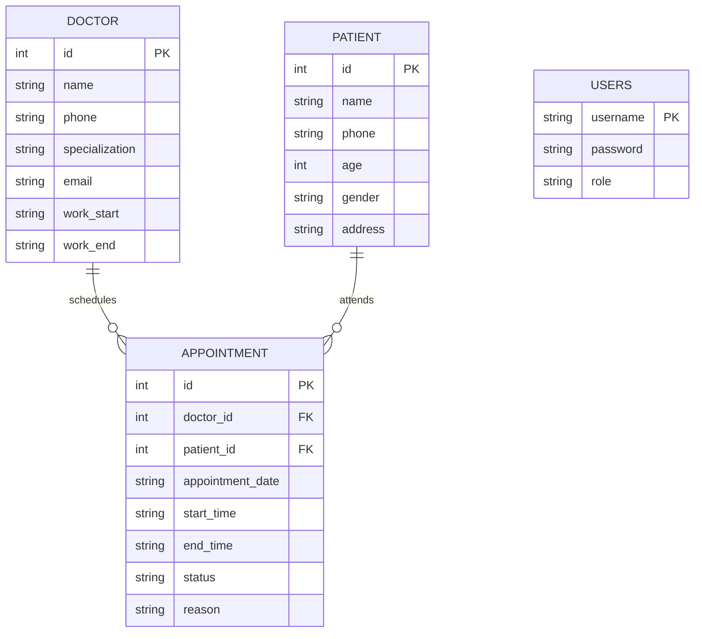

# Entity relationship diagram

```mermaid
erDiagram
    DOCTOR ||--o{ APPOINTMENT : schedules
    PATIENT ||--o{ APPOINTMENT : attends

    DOCTOR {
        int id PK
        string name
        string phone
        string specialization
        string email
        string work_start
        string work_end
    }
    PATIENT {
        int id PK
        string name
        string phone
        int age
        string gender
        string address
    }
    APPOINTMENT {
        int id PK
        int doctor_id FK
        int patient_id FK
        string appointment_date
        string start_time
        string end_time
        string status
        string reason
    }
    USERS {
        string username PK
        string password
        string role
    }
```

`appointment.status` is one of `BOOKED`, `CANCELLED`, or `COMPLETED`. Dates and times are stored in ISO-8601 text format.
